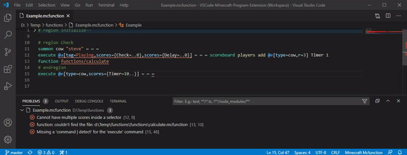

# VSCode-Bedrock-Development-Extension

An extension that provides support for files such as: `.mcfunction`, `.json` and `.lang`. Features include: completion, validations, formatters, diagnostics, cheat-sheets,
code-actions, generation of files, and development tools to help develop Minecraft Bedrock Addons or Minecraft Education Edition. It's recommended you use the Dark+ theme for the
best color highlighting.

  

## Content

- [VSCode-Bedrock-Development-Extension](#vscode-bedrock-development-extension)
  - [Content](#content)
  - [Features](#features)
    - [Minecraft project files](#minecraft-project-files)
    - [Mcfunction](#mcfunction)
    - [JSON](#json)
      - [Molang](#molang)
      - [Validation](#validation)
    - [Language files](#language-files)
    - [Molang](#molang-1)
  - [Cheat Sheets](#cheat-sheets)
  - [Commands](#commands)
  - [Extension Settings](#extension-settings)
  - [Licenses](#licenses)

## Features

### Minecraft project files

Can read the following minecraft project files

- [`.mcattributes`](./documentation/project/MCAttributes.md)
- [`.defintions`](./documentation/project/MCDefintions.md)
- [`.mcignore`](./documentation/project/MCIgnore.md)

### Mcfunction

This plugin provides support for the `.mcfunction` files. The following features are provided:

- [Code completion](documentation/completion/Mcfunctions.md).
- Code formatting.
- Code action.
- Diagnostics.
- Go to definition.
- Regions.
- Symbols.
- Syntax highlighting.
- [Validation files for diagnosing](documentation/Commands.md).

---

### JSON

#### Molang

This plugin provides automatic highlighting for Molang code in JSON files.

#### Validation

Automatic JSON validation is applied if the files follow a given pattern for naming or proper file structure.  
For resource packs, have the files in a folder with the letter `RP` or `rp` in the name, or in the world folder: `resource_packs`.  
For behavior packs, have the files in a folder with the letter `BP` or `bp` in the name, or in the world folder: `behavior_packs`.

- [**General**](./documentation/Json%20Validation.md#general)
  - Manifests
  - Languages
  - Language names
- [**World**](./documentation/Json%20Validation.md#world)
  - world_behavior_packs
  - world_resource_packs
- [**Resource packs**](./documentation/Json%20Validation.md#resource-packs)
  - Animation controllers
  - Animations
  - Attachables
  - Biomes
  - Blocks
  - Entities
  - Entity models
  - Flipbook textures
  - Item textures
  - Materials
  - Music definitions
  - Particles
  - Render controllers
  - Sound definitions
  - Sounds
  - Terrain textures
- [**Behavior packs**](./documentation/Json%20Validation.md#behavior-packs)
  - Animation controllers
  - Animations
  - Blocks
  - Entity behaviors
  - Item behaviors
  - Loot tables
  - Recipes
  - Spawn rules
  - Trading
- [**Skin packs**](./documentation/Json%20Validation.md#skinpacks)
  - Skins.json

---

### Language files

This plugin provides support for `.lang` files. The following features are provided:

- Code formatting.
- Diagnostics.
- Regions.
- Symbols.
- Syntax highlighting.

---

### Molang

This plugin provides automatic highlighting for Molang code in JSON files and .molang files. Officially .molang files are not supported by Minecraft, but they're useful for
development.

---

## Cheat Sheets

Cheat Sheets has been added for easy lookup.

---

## Commands

A complete list can be found [here](documentation/Commands.md). These commands provide things such as cheat sheets, diagnostics, and creation of files

---

## Extension Settings

| Settings                           | Description                                                                                                                                          |
| ---------------------------------- | ---------------------------------------------------------------------------------------------------------------------------------------------------- |
| **Use Education Content**          | Adds Education Edition content such as items, blocks, entities and commands into code suggestions and debugging. Requires a restart for full effect. |
| **Use Diagnostics Languages**      | Turn the diagnostics for language files on or off. Requires a restart for full effect.                                                               |
| **Use Diagnostics Mcfunctions**    | Turn the diagnostics for mcfunctions files on or off. Requires a restart for full effect.                                                            |
| **Use Diagnostics Json**           | Turn on or off the diagnostics for json files                                                                                                        |
| **Use Diagnostics For Objectives** | Turn on or off the diagnostics for scoreboard objectives                                                                                             |
| **Use Diagnostics For Tags**       | Turn on or off the diagnostics for tags                                                                                                              |

---

## Licenses

All thrid party code and libraries this plugin uses are listed [**here**](./LICENSES/Licenses.md)!
