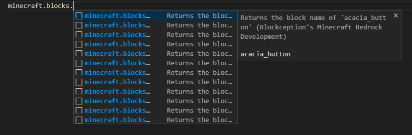

# Snippets
Snippets have been added for mcfunctions and .lang files.
The following snippets have been added and how to access them.

**Contents**
- [Snippets](#snippets)
  - [General](#general)
  - [Minecraft Language Files](#minecraft-language-files)
    - [Region snippets](#region-snippets)


## General

A list of snippets as been added to mcfunctions and languages files. these can be access through typing 'snippet.<category>'



|Snippet Collection|How to access|
|------------------|-------------|
|Block names|A list of all the block names have been stored as snippets, these can be accessed through typing: 'snippet.blocks'.|
|Commands|A list of all minecraft commands and their syntax are stored as snippets; these can be accessed through 'snippet.commands'.|
|Effect names|A list of all the effect names have been stored as snippets, these can be accessed through typing: 'snippet.effects'.|
|Enchantment names|A list of all the enchantment names have been stored as snippets, these can be accessed through typing: 'snippet.enchants'.|
|Item names|A list of all item names have been stored as snippets, these can be accessed through typing: 'snippet.item'.|

---
## Minecraft Language Files

### Region snippets
Added region snippets, so you can use comments to region of sections of with code by using the following comments:

```Csharp
##region
..Some language
##endregion
```

The extension recognizes this and allows the code to be folded